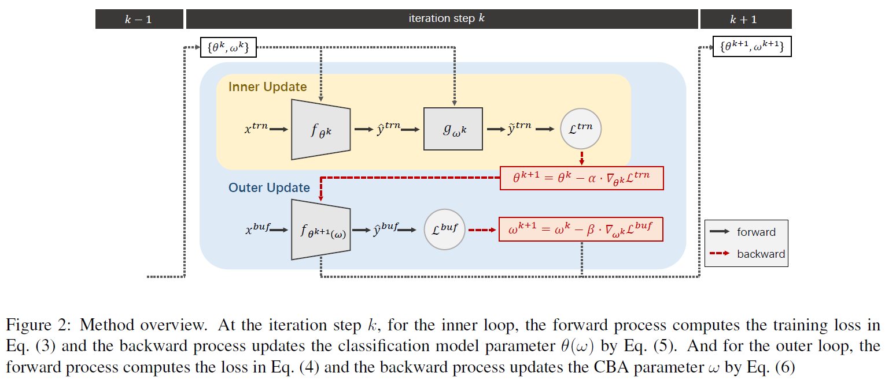

# CBA-online-CL

This is an official PyTorch implementation of [**"CBA: Improving Online Continual Learning via Continual Bias Adaptor"**](https://arxiv.org/abs/2308.06925) by Quanziang Wang, Renzhen Wang, Yichen Wu, Xixi Jia, and Deyu Meng.

Please contact Quanziang Wang ([quanziangwang@gmail.com](mailto:quanziangwang@gmail.com)), Renzhen Wang ([rzwang@xjtu.edu.cn](mailto:rzwang@xjtu.edu.cn)), or Deyu Meng ([dymeng@xjtu.edu.cn](mailto:dymeng@xjtu.edu.cn)).



* We extended the [Mammoth](https://github.com/aimagelab/mammoth) framework with our method and applied it to various rehearsal-based baselines.


## Setup and Training

* Use `python utils/main.py` to run experiments.

* Results will be saved in `./results`.

* Training examples:

  * Baseline **DER++** on **CIFAR-100** with buffer size **M=2000**

    `python utils/main.py --model derpp --backbone resnet18 --dataset seq-cifar100 --lr 0.03 --batch_size 32 --minibatch_size 32 --n_epochs 1 --buffer_size 2000 --seed <5000> --gpu_id <0> --exp <onl-buf2000>`

  * Our method **DER-CBA** on **CIFAR-100** with buffer size **M=2000**

    `python utils/main.py --model derpp_cba_online --backbone resnet18-meta --dataset seq-cifar100 --lr 0.03 --batch_size 32 --minibatch_size 32 --n_epochs 1 --buffer_size 2000 --seed <5000> --gpu_id <0> --exp <onl-buf2000>`

  * We recommend repeating the experiment multiple times with different random seeds to reduce the effect of randomness, especially under the online setting (*i.e.*, `--n_epochs 1`).


## Requirements

* torch==1.7.0
* torchvision=0.9.0
* quadprog=0.1.7


## Cite Our Work

If you find our work or this code is useful, please cite us:

```
@inproceedings{cba,
  title={CBA: Improving Online Continual Learning via Continual Bias Adaptor},
  author={Wang, Quanziang and Wang, Renzhen and Wu, Yichen and Jia, Xixi and Meng, Deyu},
  booktitle={ICCV},
  year={2023}
}
```


